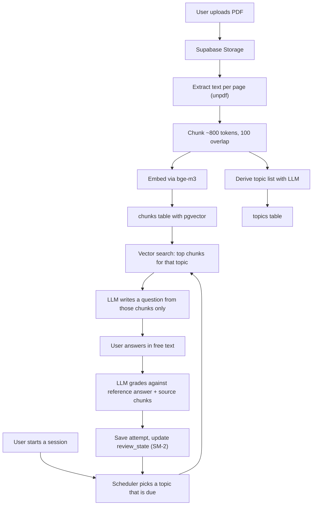

# Recall — build guide for an AI study tutor

This repository holds the planning material for **Recall**, an AI study tutor you upload your
lecture slides to. It generates practice questions from *your* material, grades your written
answers, and schedules what to review based on what you keep getting wrong.

There is no application code here. This repo is the brief: what to build, how it should look,
and the exact prompts to paste into a fresh Cursor chat to build it step by step.

- [docs/design.md](docs/design.md) — the design spec: screens, visual direction, every state
- [docs/prompts.md](docs/prompts.md) — sequenced prompts, copy-paste in order
- [docs/cursor-rules.md](docs/cursor-rules.md) — paste into the project's `.cursor/rules/` so quality stays consistent

---

## Why this project is worth your time

Most first-year portfolios are five to-do apps. This project is different for three reasons that
an interviewer will actually pick up on:

1. **It uses retrieval-augmented generation (RAG).** Chunking documents, embedding them, and
   retrieving the right passages before you call a model is the single most in-demand skill in
   internship postings right now. It is also the part most beginners skip, because they just pipe
   the whole document into the prompt and hope.
2. **It has a real algorithm in it.** The spaced-repetition scheduler gives you something to talk
   about that isn't "and then I saved it to the database." You can explain a decision you made.
3. **You are the user.** You built it because you needed it for your own courses. That story lands
   far better than "I followed a tutorial."

## Scope: build this, not more

The temptation will be to add classrooms, sharing, teams, a mobile app. Don't. One complete slice,
finished and deployed, beats a half-built platform every time.

**In scope for v1:**

- Upload a PDF (lecture slides, textbook chapter, your own notes)
- The app extracts text, splits it into chunks, and embeds them
- It derives a list of topics covered by the document
- You start a study session and it asks you questions grounded in your material
- You answer in free text; the model grades you, explains what you missed, and cites the source page
- A progress view shows which topics are solid and which are shaky
- Questions you get wrong come back sooner

**Explicitly out of scope for v1:** multi-user sharing, image/diagram understanding, voice, payment,
mobile app, a browser extension, "AI chat with your PDF" (it's a different product — resist it).

## Recommended stack

| Layer | Choice | Why |
| --- | --- | --- |
| Framework | Next.js (App Router) + TypeScript | The stack most internship postings ask for; one repo for UI and API |
| Styling | Tailwind CSS | Fast to iterate, and you're a designer — you'll want direct control |
| Components | shadcn/ui | Accessible primitives you own the code for; don't hand-roll dialogs |
| Database | Supabase (Postgres + `pgvector`) | Free tier, and pgvector means no separate vector database |
| File storage | Supabase Storage | Same project, same client, no extra service |
| Auth | Supabase Auth (email magic link) | Add it in the final step, not the first |
| LLM + embeddings | SiliconFlow (OpenAI-compatible API) | See below — this matters |
| Charts | Recharts | Good defaults, easy to restyle |
| Deploy | Vercel, or Zeabur / Cloudflare Pages | See the note on access below |

### The model provider decision (read this one carefully)

Do **not** build on the OpenAI API. It is not reachable from mainland China without a VPN, which
means your app will fail every time you demo it on campus, and it will fail for anyone in China who
opens your live link. That is a bad way to lose an interview.

Use **[SiliconFlow](https://siliconflow.cn)** instead. It gives you one API key that covers both
things you need — chat completions and text embeddings — it's cheap enough to be effectively free at
your usage, and it's fast from Chengdu. Concretely:

- Chat / question generation / grading: `deepseek-ai/DeepSeek-V3`
- Embeddings: `BAAI/bge-m3` (1024 dimensions, and importantly it handles Chinese and English in the
  same vector space — so bilingual slides work)

The important engineering move: SiliconFlow speaks the **OpenAI-compatible protocol**, so use the
official `openai` npm package and just point `baseURL` at SiliconFlow. Put the base URL, the API
key, and both model names in environment variables. That way you can switch to OpenAI, DeepSeek
direct, Alibaba DashScope, or a local Ollama model by changing `.env` — no code changes. Mention
this in your README; it reads as maturity.

Alternates if SiliconFlow doesn't work out: **DeepSeek** direct (chat only, no embeddings API — you'd
need embeddings elsewhere), **Alibaba DashScope** (`qwen-plus` + `text-embedding-v3`), or **Zhipu GLM**.

### Deployment note

Vercel is the easiest deploy and its dashboard works fine, but `*.vercel.app` domains are
intermittently blocked from mainland China. If you want the live link to work reliably for people on
campus, either put a custom domain in front of it (Cloudflare in the middle) or deploy to
**[Zeabur](https://zeabur.com)**, which is popular in the Chinese dev community and handles Next.js
well. Have a live URL either way — a GitHub repo with no live demo gets skipped.

## Data model

Seven tables. Keep it this small.

```
profiles        one row per user, mirrors Supabase auth
documents       id, user_id, title, filename, storage_path, page_count,
                status (uploaded|parsing|embedding|ready|failed), created_at
chunks          id, document_id, content, page_number, token_count,
                embedding vector(1024)          <- pgvector, IVFFlat index
topics          id, document_id, name, summary
questions       id, document_id, topic_id, kind (short_answer|multiple_choice),
                prompt, reference_answer, options jsonb, source_chunk_ids uuid[],
                difficulty smallint
attempts        id, question_id, user_id, user_answer, score numeric(3,2),
                feedback, created_at
review_state    id, question_id, user_id, ease numeric, interval_days int,
                repetitions int, due_at timestamptz
```

Two things to get right early, because they're annoying to retrofit:

- **Row Level Security on every table**, from the beginning. It's a one-line policy per table and
  it's the difference between "student project" and "knows how production works."
- **`source_chunk_ids` on questions.** This is what lets you show "from page 14" next to a question.
  Citing the source is the feature that makes people trust the app, and it costs almost nothing if
  you store it up front.

## How the pipeline works



The rule that makes or breaks quality: **the model may only write questions from the retrieved
chunks.** If you let it answer from its own general knowledge, it will invent questions about
material that isn't in your slides, and the whole premise collapses. Say this explicitly in the
system prompt, and have it return the chunk ids it used.

## Spaced repetition, kept simple

Use a trimmed SM-2. Per question you track `ease` (starts at 2.5), `interval_days` (starts at 0),
and `repetitions`. After grading you get a score from 0 to 1:

- score >= 0.8 — correct. `repetitions++`, interval becomes 1, then 3, then `previous * ease`
- score 0.5 to 0.8 — shaky. Keep the interval short, around 1 day, nudge ease down slightly
- score < 0.5 — wrong. Reset `repetitions` to 0, interval to 0 (due again this session), drop ease
  by 0.2 with a floor of 1.3

A topic's mastery is the average of recent scores across its questions. That's what drives the
colors in the progress view. Don't over-engineer this — write it as a pure function with unit tests.
It's the easiest place in the whole project to have real tests, and having tests at all puts you
ahead of most applicants.

## GitHub: how to set this up so it counts

Recruiters look at the repo, not just the app. Some specifics:

- **Create the repo first, before writing code.** In Cursor's cloud agent view there's a
  "Create repo" control that will make the GitHub repo and connect it; otherwise create it on GitHub
  and `git remote add origin`. Either way, the agent should commit and push as it goes.
- **Commit per logical change, not one giant dump.** A history of 40 meaningful commits over weeks
  tells a story. One commit called "init" tells the opposite story. The prompts in
  [docs/prompts.md](docs/prompts.md) instruct the agent to commit and push after each step.
- **Never commit `.env.local`.** Commit a `.env.example` with the key names and empty values. If you
  ever do leak a key, rotate it immediately — don't just delete the commit.
- **Write the README as if it's your portfolio page.** A one-line description, a screenshot or GIF at
  the very top, the live link, the stack, what problem it solves, one paragraph on an interesting
  technical decision (the RAG grounding rule or the scheduler). Interviewers read exactly this much.
- **Add a GitHub Actions workflow** that runs typecheck, lint, and tests on every push. The green
  check mark on your commits is a disproportionately strong signal for how little work it is.
- **Work on branches and open PRs to yourself.** It feels silly for a solo project, but it shows you
  know the workflow you'll be dropped into on day one of an internship.
- **Pin the repo on your GitHub profile** and put the live link in your LinkedIn featured section.

## Suggested build order

Each of these maps to a prompt in [docs/prompts.md](docs/prompts.md). Stop and actually use the app
after every step — that's how you catch the design problems.

1. Repo, GitHub, project rules
2. Scaffold, design system, app shell and navigation
3. Upload and PDF parsing
4. Chunking, embeddings, vector search
5. Topic extraction
6. Question generation, grounded in retrieved chunks
7. The study session UI
8. Grading and feedback
9. The scheduler, with unit tests
10. Progress dashboard
11. Auth and Row Level Security
12. Polish: empty states, loading, errors, mobile, README, CI
13. Deploy

## Extra ideas, once v1 is deployed

Only after it's live and you've used it for a real exam. In rough order of how much each adds to the
portfolio:

- **A "explain this like I'm stuck" button** on any question you get wrong, which pulls the relevant
  slides and walks through the concept. Cheap to build, very demo-friendly.
- **Streaming responses** for grading and explanations. Purely a UX upgrade, but the difference
  between a 4-second blank screen and text appearing immediately is enormous.
- **An eval set.** Write 20 known-good question/answer pairs and a script that checks your grader
  agrees with you. This is what AI engineers actually spend their time on, and almost no student
  project has it. If you want one thing that makes an interviewer sit up, it's this.
- **Import from images** of handwritten notes, via a vision model.
- **A shared library** so classmates can study from the same uploaded course, which turns it into
  something with real users at UESTC — and "180 students use it" is the strongest line you can put
  on a resume as a first-year.
